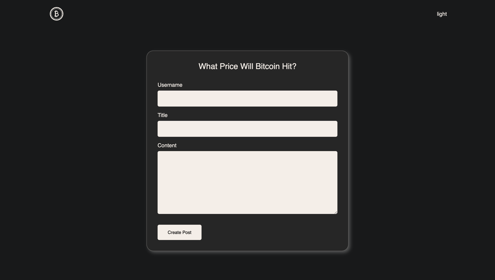

# challenge04-owen-kanzler

## Description

This is challenge 04 of the UMN Bootcamp. Here I created a blog where the user can post blog posts using the form and it will stay saved within local storage. I used different strategies to retrieve an array of blog post objects from local storage and then for each post I manipulated the dom to render each post accordingly.

## Assets

## Usage

https://owenkanzler.github.io/challenge04-owen-kanzler/

## License

Please refer to the LICENSE in the repo.
